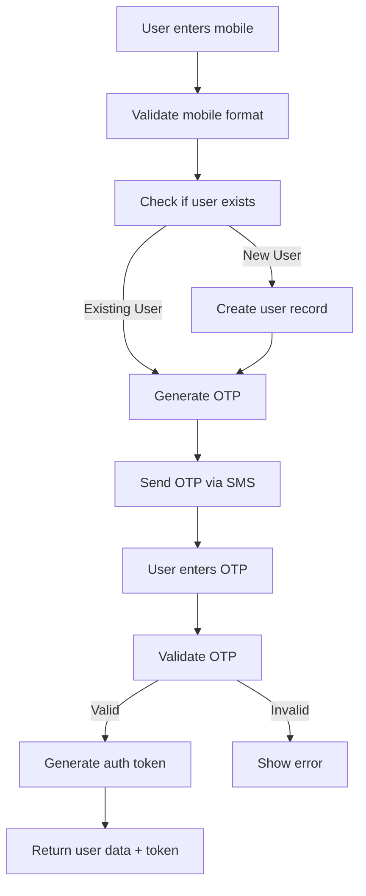
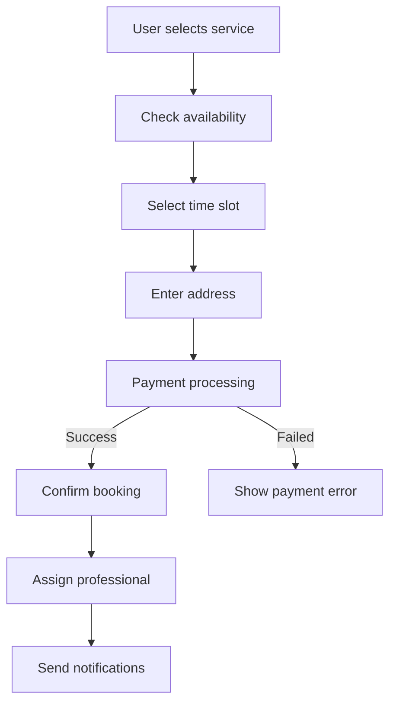
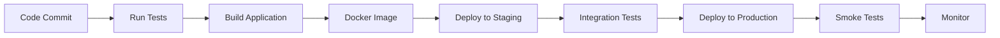

# YesMadam API Setup Guide

## 📋 Table of Contents

- [Overview](#overview)
- [Business Context](#business-context)
- [API Architecture](#api-architecture)
- [Authentication System](#authentication-system)
- [API Endpoints](#api-endpoints)
- [Data Models](#data-models)
- [Environment Configuration](#environment-configuration)
- [Integration Patterns](#integration-patterns)
- [Business Logic](#business-logic)
- [Testing Scenarios](#testing-scenarios)

## 🎯 Overview

The YesMadam API is a comprehensive service platform API that provides authentication, user management, and service booking capabilities. This API serves the YesMadam mobile application and web platform, enabling users to access beauty and wellness services.

### API Specifications

- **Base URL**: `https://api-live.yesmadam.com`
- **API Version**: `v3`
- **Content Type**: `application/json`
- **Authentication**: Token-based authentication
- **Response Format**: JSON

## 🏢 Business Context

### Company Overview
YesMadam is a beauty and wellness service platform that connects customers with trained professionals for at-home services including:

- Beauty treatments (facials, cleanups, threading)
- Hair care services (haircuts, styling, treatments)
- Wellness services (massage, spa treatments)
- Bridal packages and special occasion services

### Target Audience
- Urban women aged 18-45
- Working professionals
- Homemakers seeking convenient beauty services
- Event-specific beauty requirements

## 🏗️ API Architecture

### System Architecture

```
┌─────────────────┐    ┌──────────────────┐    ┌─────────────────┐
│   Mobile/Web    │───▶│   YesMadam API   │───▶│   Backend       │
│   Applications  │    │   (api-*.yesmadam.com) │   │   Services      │
└─────────────────┘    └──────────────────┘    └─────────────────┘
         │                       │                       │
         ▼                       ▼                       ▼
┌─────────────────┐    ┌──────────────────┐    ┌─────────────────┐
│   Authentication│    │   User Management│    │ Service Catalog │
│   & OTP         │    │   & Profiles     │    │   & Booking     │
└─────────────────┘    └──────────────────┘    └─────────────────┘
```

### Technology Stack
- **Backend**: Node.js/Express.js
- **Database**: MongoDB
- **Authentication**: JWT tokens with OTP verification
- **SMS Service**: Third-party SMS gateway for OTP
- **File Storage**: AWS S3 for media files
- **Caching**: Redis for session management

## 🔐 Authentication System

### Two-Factor Authentication Flow

#### Phase 1: Mobile Number Verification
**Endpoint**: `POST /v3/userapi/login`

**Purpose**: Validate mobile number and send OTP

**Request**:
```json
{
  "mobile": 9855566677
}
```

**Response**:
```json
{
  "status_code": 401,
  "status": "success",
  "message": "move on otp verification page",
  "object": {},
  "token": {},
  "object2": {}
}
```

#### Phase 2: OTP Verification
**Endpoint**: `POST /v3/userapi/otp/verification`

**Purpose**: Verify OTP and generate authentication token

**Request**:
```json
{
  "mobile": 9855566677,
  "otp": 2222
}
```

**Response**:
```json
{
  "status_code": 0,
  "status": "success",
  "message": "eyJhbGciOiJIUzI1NiIsInR5cCI6IkpXVCJ9...",
  "object": {
    "user_id": "user123",
    "email": "user@example.com",
    "mobile": 9855566677,
    "first_name": "John",
    "last_name": "Doe",
    "profile_image": "https://s3.amazonaws.com/..."
  }
}
```

### Authentication Token Usage

#### Token Format
```
Bearer eyJhbGciOiJIUzI1NiIsInR5cCI6IkpXVCJ9...
```

#### Token Headers
```javascript
{
  "Authorization": "Bearer <token>",
  "Content-Type": "application/json",
  "Accept": "application/json"
}
```

## 📡 API Endpoints

### Authentication Endpoints

#### 1. Login (`POST /v3/userapi/login`)
- **Description**: Initiate authentication process
- **Rate Limit**: 5 requests per minute per mobile number
- **Validation**: Mobile number format validation

#### 2. OTP Verification (`POST /v3/userapi/otp/verification`)
- **Description**: Complete authentication with OTP
- **Rate Limit**: 3 attempts per mobile number
- **OTP Expiry**: 5 minutes from generation

#### 3. Logout (`POST /v3/userapi/logout`)
- **Description**: Invalidate user session
- **Authentication**: Required

### User Management Endpoints

#### 1. Profile (`GET /v3/userapi/profile`)
- **Description**: Retrieve user profile information
- **Authentication**: Required

#### 2. Update Profile (`PUT /v3/userapi/profile/update`)
- **Description**: Update user profile details
- **Authentication**: Required

## 📊 Data Models

### User Object Schema

```json
{
  "user_id": "string/number",
  "email": "string",
  "mobile": "number",
  "first_name": "string",
  "last_name": "string",
  "date_of_birth": "string (YYYY-MM-DD)",
  "gender": "string (male/female/other)",
  "profile_image": "string (URL)",
  "address": {
    "street": "string",
    "city": "string",
    "state": "string",
    "pincode": "number",
    "coordinates": {
      "latitude": "number",
      "longitude": "number"
    }
  },
  "preferences": {
    "language": "string",
    "notifications": "boolean",
    "marketing_emails": "boolean"
  },
  "created_at": "string (ISO date)",
  "updated_at": "string (ISO date)",
  "is_active": "boolean",
  "is_verified": "boolean"
}
```

### Service Object Schema

```json
{
  "service_id": "string",
  "name": "string",
  "category": "string",
  "subcategory": "string",
  "description": "string",
  "price": "number",
  "duration": "number (minutes)",
  "image": "string (URL)",
  "is_active": "boolean",
  "requirements": ["string"],
  "precautions": ["string"]
}
```

### Booking Object Schema

```json
{
  "booking_id": "string",
  "user_id": "string",
  "service_id": "string",
  "professional_id": "string",
  "scheduled_at": "string (ISO date)",
  "status": "string (pending/confirmed/completed/cancelled)",
  "address": "object",
  "notes": "string",
  "total_amount": "number",
  "payment_status": "string (pending/paid/refunded)",
  "created_at": "string (ISO date)",
  "updated_at": "string (ISO date)"
}
```

## 🌍 Environment Configuration

### Environment URLs

| Environment | Base URL | Purpose |
|-------------|----------|---------|
| Production | `https://api-live.yesmadam.com` | Live customer traffic |
| Staging | `https://api-staging.yesmadam.com` | Pre-production testing |
| Development | `https://api-dev.yesmadam.com` | Development testing |

### Environment-Specific Features

#### Production Environment
- Full feature set enabled
- Real SMS gateway integration
- Payment processing enabled
- Comprehensive logging
- Performance monitoring

#### Staging Environment
- All production features except payments
- Test SMS gateway
- Simulated payment responses
- Detailed error logging

#### Development Environment
- Mock services for external dependencies
- Local database instance
- Development tools enabled
- Verbose logging

## 🔗 Integration Patterns

### SMS Integration

#### OTP Service Integration
```javascript
// SMS Service Provider Configuration
{
  provider: "twilio/msg91",
  api_key: "your_api_key",
  sender_id: "YESMAD",
  template: "Your OTP for YesMadam is: {otp}"
}
```

#### OTP Generation Logic
```javascript
// OTP Generation Algorithm
function generateOTP() {
  return Math.floor(1000 + Math.random() * 9000);
}

// OTP Hashing for Security
function hashOTP(otp, mobile) {
  return crypto.createHash('sha256')
    .update(otp + mobile + process.env.OTP_SECRET)
    .digest('hex');
}
```

### Payment Integration

#### Payment Gateway Configuration
```javascript
// Payment Provider Setup
{
  provider: "razorpay/paytm",
  merchant_id: "your_merchant_id",
  api_key: "your_api_key",
  webhook_secret: "your_webhook_secret"
}
```

### File Upload Integration

#### AWS S3 Configuration
```javascript
// S3 Bucket Configuration
{
  bucket: "yesmadam-user-uploads",
  region: "ap-south-1",
  access_key: "your_access_key",
  secret_key: "your_secret_key",
  cloudfront_url: "https://cdn.yesmadam.com"
}
```

## 💼 Business Logic

### User Registration Flow



### Service Booking Flow



### OTP Verification Logic

#### OTP Generation Rules
- **Length**: 4 digits
- **Validity**: 5 minutes
- **Attempts**: Maximum 3 attempts per mobile number
- **Rate Limiting**: 5 OTP requests per hour per mobile number

#### OTP Validation Process
1. Check if OTP exists for mobile number
2. Verify OTP hasn't expired
3. Validate attempt count
4. Compare provided OTP with stored hash
5. Generate authentication token on success

## 🧪 Testing Scenarios

### Authentication Testing

#### Positive Test Cases
1. **Valid mobile number format**
   - Input: 10-digit mobile number
   - Expected: OTP sent successfully

2. **Valid OTP verification**
   - Input: Correct OTP within time limit
   - Expected: Authentication token generated

3. **Existing user login**
   - Input: Registered mobile number
   - Expected: Existing user data returned

#### Negative Test Cases
1. **Invalid mobile format**
   - Input: Non-10-digit number
   - Expected: Validation error

2. **Incorrect OTP**
   - Input: Wrong OTP
   - Expected: Authentication failed

3. **Expired OTP**
   - Input: OTP after 5-minute expiry
   - Expected: OTP expired error

4. **Maximum attempts exceeded**
   - Input: 4th wrong OTP attempt
   - Expected: Account temporarily locked

### Performance Testing

#### Load Testing Scenarios
- **Concurrent users**: 1000 simultaneous authentication requests
- **Response time**: < 2 seconds for OTP generation
- **Throughput**: 100 requests/second sustained load

#### Stress Testing
- **Peak load**: 5000 authentication requests/minute
- **Memory usage**: < 1GB under sustained load
- **Error rate**: < 1% under stress conditions

## 🔧 Development Setup

### Local Development Environment

#### Prerequisites
```bash
# Required tools
Node.js 18+
MongoDB 5+
Redis 6+
AWS CLI (for S3 operations)
```

#### Environment Variables
```bash
# .env file
NODE_ENV=development
PORT=3000
MONGODB_URI=mongodb://localhost:27017/yesmadam_dev
REDIS_URI=redis://localhost:6379
JWT_SECRET=your_jwt_secret
OTP_SECRET=your_otp_secret
SMS_API_KEY=your_sms_api_key
AWS_ACCESS_KEY=your_aws_key
AWS_SECRET_KEY=your_aws_secret
PAYMENT_GATEWAY_KEY=your_payment_key
```

#### Database Setup
```bash
# Create development database
use yesmadam_dev

# Create collections
db.createCollection('users')
db.createCollection('services')
db.createCollection('bookings')
db.createCollection('otp_sessions')

# Create indexes
db.users.createIndex({ mobile: 1 }, { unique: true })
db.otp_sessions.createIndex({ mobile: 1, expires_at: 1 })
```

### API Testing Setup

#### Test Database
```bash
# Separate test database
use yesmadam_test

# Test user data
db.users.insertOne({
  user_id: "test_user_001",
  mobile: 9855566677,
  email: "test@example.com",
  first_name: "Test",
  last_name: "User",
  is_active: true,
  is_verified: true,
  created_at: new Date(),
  updated_at: new Date()
})
```

#### Mock Services
```javascript
// Mock SMS service for testing
const mockSMSService = {
  sendOTP: (mobile, otp) => {
    console.log(`Mock SMS: OTP ${otp} sent to ${mobile}`);
    return Promise.resolve({ success: true });
  }
};

// Mock payment service for testing
const mockPaymentService = {
  processPayment: (amount, token) => {
    return Promise.resolve({
      success: true,
      transaction_id: "mock_txn_123",
      status: "success"
    });
  }
};
```

## 📊 Monitoring and Analytics

### Key Metrics
- **Authentication Success Rate**: > 95%
- **Average Response Time**: < 500ms
- **OTP Delivery Rate**: > 98%
- **User Registration Rate**: Target conversion rate
- **Error Rate**: < 1%

### Monitoring Tools
- **Application Performance Monitoring**: New Relic/DataDog
- **Error Tracking**: Sentry
- **API Analytics**: Custom dashboard
- **SMS Delivery Monitoring**: SMS provider dashboard

## 🔒 Security Considerations

### Authentication Security
- **OTP Encryption**: OTPs encrypted in database
- **Rate Limiting**: Prevents brute force attacks
- **Session Management**: Secure token expiration
- **Mobile Validation**: Format and existence validation

### Data Protection
- **PII Encryption**: Personal data encrypted at rest
- **API Security**: HTTPS only, no plain HTTP
- **Input Validation**: All inputs sanitized
- **CORS Configuration**: Restricted origins only

## 🚀 Deployment

### Deployment Pipeline


### Deployment Checklist
- [ ] Database migrations completed
- [ ] Environment variables configured
- [ ] External services connected
- [ ] Monitoring setup verified
- [ ] Backup systems tested
- [ ] Rollback plan documented

## 📋 API Version History

### Version 3.0 (Current)
- Enhanced authentication flow
- Improved error handling
- Better rate limiting
- Enhanced logging

### Version 2.0
- Added OTP verification
- User profile management
- Service catalog integration

### Version 1.0
- Basic authentication
- Simple user registration
- Core API structure

## 🤝 Support and Maintenance

### API Support
- **Documentation**: Swagger/OpenAPI documentation
- **Support Channels**: Email, Slack, Jira tickets
- **Response Time**: < 24 hours for critical issues
- **Maintenance Window**: Weekly maintenance windows

### Troubleshooting Guide

#### Common Issues
1. **OTP Not Received**
   - Check SMS service status
   - Verify mobile number format
   - Check rate limiting

2. **Authentication Failures**
   - Verify OTP within time limit
   - Check attempt count
   - Validate token format

3. **Performance Issues**
   - Monitor database performance
   - Check external service status
   - Review error logs

## 📈 Future Enhancements

### Planned Features
- [ ] Social media authentication
- [ ] Multi-factor authentication
- [ ] Advanced user preferences
- [ ] Real-time notifications
- [ ] Enhanced analytics
- [ ] API rate limiting dashboard

### Scalability Improvements
- [ ] Microservices architecture
- [ ] Database sharding
- [ ] CDN integration
- [ ] Advanced caching strategies

---

This documentation provides comprehensive information about the YesMadam API setup, architecture, and integration patterns. For specific implementation details or technical support, please refer to the development team or check the API documentation portal.